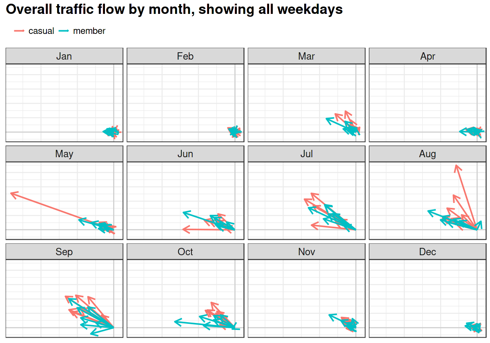

```{r setup, include=FALSE}
knitr::opts_chunk$set(echo = TRUE)
```

I'm a data analyst in Vancouver, Canada, and these are my public projects.


- [Data analytics on Chicago's Divvy Bikeshare](https://andrewluyt.github.io/divvy-bikeshare/) (GitHub project)<br>An analysis of the public dataset from *Divvy*, a bike sharing service in Chicago. Traffic patterns are visualized and the differences between *Divvy* members and casual users are explored.<br><br>
 <br>
- [Evidence for social unrest in a bicycle use dataset](https://www.kaggle.com/andyinverted/evidence-for-social-unrest-in-bicycle-usage-data) (Kaggle notebook)<br>Exploratory data analysis of the *Divvy* dataset leads to a surprising signal hiding in the data.<br><br>
 <br>

