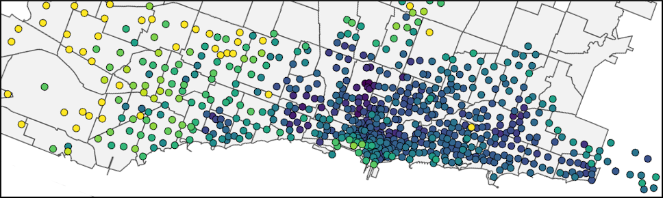
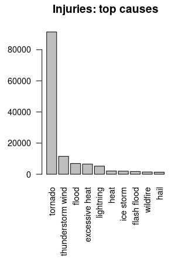

```{r setup, include=FALSE}
knitr::opts_chunk$set(echo = TRUE)
```

[ My LinkedIn](https://www.linkedin.com/in/andrew-luyt/){target="_blank"}

I'm a data analyst in Vancouver, Canada, and these are my public projects. 



## [1. AI-Assisted Exercise](https://andrewluyt.github.io/accelerometer-predictions/)

[](https://andrewluyt.github.io/accelerometer-predictions/)

I built an AI model that can check if a person's form is incorrect during
weightlifting, using data from a wearable smart device.

----

## [2. A brief analysis: Vancouver's Mobi Bikeshare](https://rpubs.com/agl/mobi)
**Three visualizations** are prepared to quickly demonstrate traffic flow, station usage, and seasonal ride variation for the bike sharing network.

[](https://rpubs.com/agl/mobi/)

----

## [3. Detailed analytics: Chicago's Divvy Bikeshare](https://andrewluyt.github.io/divvy-bikeshare/)

**Using a dataset of over four million bicycle rides,** traffic volume and flow patterns are visualized, and the differences between yearly members and casual users are explored. The
data are explored in much more detail than in the Mobi analysis.

[](https://andrewluyt.github.io/divvy-bikeshare/)

----

## [4. Destructive Weather Events, 1950-2011](https://rpubs.com/agl/852813)
**Extensive data cleaning** of an old NOAA dataset is required to discover the
most costly types of weather events in the USA, in terms of human and financial 
damage. Done as a final project in the Johns Hopkins course *Reproducible Research*,
it is presented with inline R code.

[](https://rpubs.com/agl/852813)

----

## [5. Evidence for social unrest in a bicycle use dataset](https://www.kaggle.com/andyinverted/evidence-for-social-unrest-in-bicycle-usage-data)
**Exploratory visual data analysis** of the *Divvy* dataset leads to a surprising signal hiding in the data. *Hosted on Kaggle.com as a notebook.*

[](https://www.kaggle.com/andyinverted/evidence-for-social-unrest-in-bicycle-usage-data)

