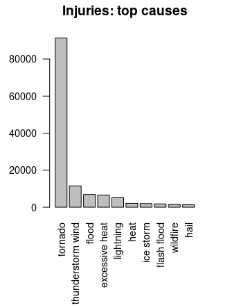
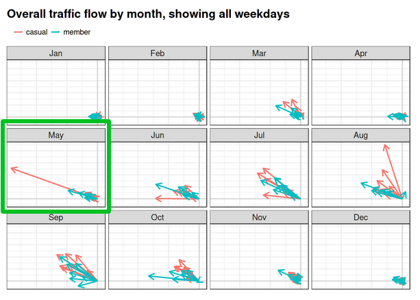

Andrew Luyt’s Projects
================
Last updated 2022-01-15

<a href="https://www.linkedin.com/in/andrew-luyt/" target="_blank"> My LinkedIn</a>

I’m a data analyst in Vancouver, Canada, and these are my public
projects.

## <a href="https://rpubs.com/agl/mobi" target="_blank">1. A brief analysis: Vancouver’s Mobi Bikeshare</a>

**Three visualizations** are prepared to quickly demonstrate traffic
flow, station usage, and seasonal ride variation for the bike sharing
network.

------------------------------------------------------------------------

## <a href="https://andrewluyt.github.io/divvy-bikeshare/" target="_blank">2. Detailed analytics: Chicago’s Divvy Bikeshare</a>

**Using a dataset of over four million bicycle rides,** traffic volume
and flow patterns are visualized, and the differences between yearly
members and casual users are explored. The data are explored in much
more detail than in the Mobi analysis.

------------------------------------------------------------------------

## <a href="https://rpubs.com/agl/852813" target="_blank">3. Destructive Weather Events, 1950-2011</a>

**Extensive data cleaning** of an old NOAA dataset is required to
discover the most costly types of weather events in the USA, in terms of
human and financial damage. Done as a final project in the Johns Hopkins
course *Reproducible Research*, it is presented with inline R code.

------------------------------------------------------------------------

## <a href="https://www.kaggle.com/andyinverted/evidence-for-social-unrest-in-bicycle-usage-data" target="_blank">4. Evidence for social unrest in a bicycle use dataset</a>

**Exploratory visual data analysis** of the *Divvy* dataset leads to a
surprising signal hiding in the data. *Hosted on Kaggle.com as a
notebook.*

